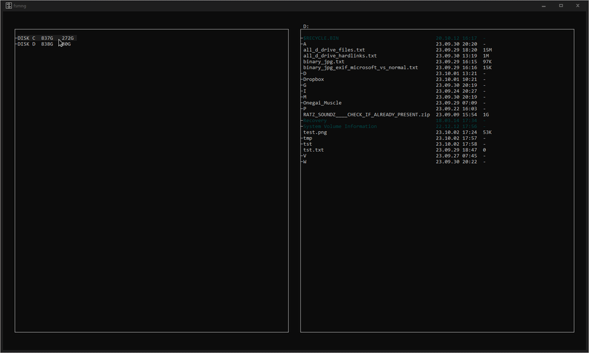

# File System Manager for Windows

[](../../releases/latest)
&nbsp;&nbsp;&nbsp;
&nbsp;&nbsp;&nbsp;[](https://www.buymeacoffee.com/sciencediscoverer)

Fast, lightweight and powerful. The key here is minimalism in everything, but the features. Interface closely mimics old-school console file managers. But it is not a console application. It has drag and drop, context menus and full mouse interface. Extensive support for hard links and symbolic links operations. Build from scratch, using nothing but the low level API and custom standard libraries optimised for Windows.



## Current state

At the present moment this program is in the state of early alpha version. Many essential file manager features are missing. Eventually, I plan to surpass `Explorer` in all the useful features, while removing annoying stuff and adding missing functionality. For now, I only implemented the bare foundation to help me manage huge amount of hard/symbolic links intuitively. So, the full list of implemented features include:

* Exploration of any directory in the system
* Navigation back to parent directory by `RMB` clicking on the folder pane path
* File size and last modify date display
* Automatic adjustment of a file name column based on a longest filename in the folder
* Scrolling support via mouse wheel only
* Hidden files detection (darker colour, for added sneakiness)
* System files detection with colour highlighting (blue)
* Detection of every hard link (green) and symbolic link (purple) in the folder
* Opening files by double clicking or context menu (default programs to execute files are hardcoded)
* Editing files by using context menu (default editors are hardcoded)
* Selecting multiple files with `CTRL` key
* Easy hard links creation using `RMB` drag and drop context menu
* Easy symbolic links creation using `RMB` drag and drop context menu (all symlinks created in the same drive as the source file, are relative, while symlinks to another drives are absolute)
* Instant directory update on any change made by any application; implemented via low level API file system event watcher (no polling!)
* Usual memory usage of around 1 MB
* Executable size of around 700 KB

## Missing features

Eventually I plan to implement this features (speed of this process will depend on outside interest):

* Basic operations - copy/move/delete
* Creating new folders
* Creating folders by duplicating existing folder's name
* Creating new files
* Hard + symbolic link aware copy/move
* Basic file renaming
* Batch file renaming with many options
* File sorting (lexicographically or as integers), including sorting by extension first
* Grouping folders together
* Some way to display truncated file names (name too long to fit in the pane with all other information)
* Scrolling via scroll bar dragging and/or keyboard keys
* Keyboard interface
* Context menu command for opening `cmd.exe` at currently active or selected folder
* "Brush" file selection mode (holding `CTRL` will make cursor "draw" over files by selecting them)
* Some kind of easily editable configuration file
* Tabs
* Saving/restoring current opened folders/tabs in/from a file
* Getting full list of other hard links that point to the same file data for any hard link in the system
* Drag and drop support to/from `Explorer` and other applications (like browsers)
* Adjustable extensive list of file information to display in the columns and do sorting on (including `mp3` tags, `exif` comments, other metadata)
* Detailed file properties mini-pane
* Search by file names and/or file contents
* Native `ZIP` file support, seamlessly browsing zip directories, search in zip
* An ability to scan filesystem rooted at selected directory and calculate all subdirectories and files sizes, displaying the percentage bars for each
* Counters of total files in folder and total selection size
* Undoing actions
* Pausing, resuming and cancelling copy/move operations
* Restoring scroll position and selection when folder content is updated and reloaded (or on return to parent directory)
* Truncating directory path displayed at the top of the folder pane for very long path
* Support for paths longer than `MAX_PATH` (260 symbols) via `\\?\` prefix
* Creation of inferior windows `.lnk` link files, without using any `com` dependencies
* Native file unlocker that will show what process blocks the file (with a possibility to kill it)
* Hard link aware duplicate files finder
* Generating thumbnails for image/video files (thumbs can be saved inside the image file's metadata, instead of separate database)
* Optionally enable icons (no more than 16x16)
* Always open for suggestions

## Current default file handlers

For now all the programs that execute/edit files are hardcoded in the source code:

```
Programs that open files:
┌───────────────────────────┬──────────────────────────────────────────────┐
│ .txt.cpp.h.log.css.js     │ C:\Program Files\Notepad++\notepad++.exe     │
│ .png.jpg.jpeg.gif.bmp.ico │ C:\Program Files\IrfanView\i_view64.exe      │
│ .mp4.mkv.avi.mov          │ C:\Program Files\MPC-HC\mpc-hc64.exe         │
│ .zip.rar.7z               │ C:\Program Files\7-Zip\7zFM.exe              │
│ .html.htm                 │ C:\Program Files\Mozilla Firefox\firefox.exe │
│ empty_extention           │ C:\Program Files\Notepad++\notepad++.exe     │
└───────────────────────────┴──────────────────────────────────────────────┘

Programs that edit files:
┌────────────────────────────────┬───────────────────────────────────────────────────────────────────────┐
│ .txt.cpp.h.log.css.js.html.htm │ C:\Program Files\Notepad++\notepad++.exe                              │
│ .png.jpg.jpeg.gif.bmp.ico      │ C:\Program Files\GIMP 2\bin\gimp-2.10.exe                             │
│ .mp4.mkv.avi.mov               │ C:\Program Files\Adobe\Adobe Premiere Pro 2020\Adobe Premiere Pro.exe │
│ default_editor                 │ C:\Program Files\Notepad++\notepad++.exe                              │
└────────────────────────────────┴───────────────────────────────────────────────────────────────────────┘
```

This programs are not included in the repository, you will have to install them yourself or edit the source code to point to the ones you are using.

## How to build

Just double-click the `msvc_build.cmd` file. Yep. As easy as this. Well, that is, if you have your Visual Studio installed, of course. And if your VS `vcvars64.bat` file is located at this path:

```
set "bat_dir=C:\Program Files\Microsoft Visual Studio\2022\Community\VC\Auxiliary\Build\vcvars64.bat"
```
If not, first of all, make sure the [Visual Studio](https://visualstudio.microsoft.com/downloads/) is installed. In the setup wizard you will see a huge list of useless features and bloat. Only the C++ build tools are actually needed. Switch to `Individual components` and try to find this in the humongous list:

```
MSVC vXXX - VS 202X C++ x64/x86 build tools (Latest)
```

After this you will have to merely locate the `vcvars64.bat` file and copy-paste the path to it into `msvc_build.cmd`. Then just launch it and wait until it does all the job for you. Yes, you don't even need to install or open the Visual Studio IDE itself. Ever.
